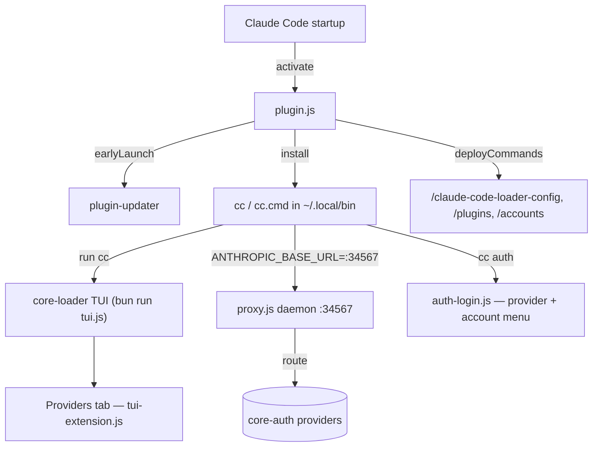

# claude-code-loader

[](https://www.npmjs.com/package/claude-code-loader)
[](https://www.npmjs.com/package/claude-code-loader)
[](https://github.com/intisy-ai/claude-code-loader/actions/workflows/publish.yml)
[](LICENSE)

TUI launcher and `cc` shell command for [Claude Code](https://github.com/anthropics/claude-code). It installs a `cc` command that opens an interactive TUI for switching projects, managing plugins, and signing in to providers, and runs an always-on local **proxy** that routes Claude requests through provider accounts (e.g. claude-code-auth subscription accounts, antigravity) with rate-limit failover. It also drives [plugin-updater](https://github.com/intisy-ai/plugin-updater) on startup.

## Under-the-Hood Architecture



## Structure

- `src/plugin.ts` — the Claude Code plugin entry (`activate`/`cleanup`); installs the `cc` wrapper, runs plugin-updater, deploys commands. Also acts as the command CLI (`node plugin.js <config|plugins|accounts>`).
- `src/proxy.ts` — the always-on proxy daemon (`claudeHub.daemon`, port 34567) that routes Claude requests through provider accounts.
- `src/auth-login.ts` — `cc auth` provider selector + account menu.
- `src/tui-extension.ts` — the custom Providers/model-mapping tab.
- `src/commands.ts` — cross-app slash-command definitions + their CLI actions.
- `core-loader/` — git submodule ([`intisy-ai/core-loader`](https://github.com/intisy-ai/core-loader)): the TUI engine.
- `core/` — git submodule ([`intisy-ai/core`](https://github.com/intisy-ai/core)): shared config + command framework.
- `dist/` — compiled output (generated; not committed).

## Requirements

- [Bun](https://bun.sh/) runtime (the TUI and proxy run under Bun).

## Installation

### Via plugin-updater (recommended)
Add to `~/.claude/config/plugins.json`:
```json
{ "name": "claude-code-loader", "url": "https://github.com/intisy-ai/claude-code-loader", "enabled": true, "autoUpdate": true }
```
Restart Claude Code — the updater clones, builds (including the submodules), and loads it; the proxy daemon starts automatically.

### Via npm
```bash
npm install claude-code-loader
```

## Usage

```bash
cc              # Launch the TUI
cc auth         # Provider selector + account menu (sign in to claude-code-auth, antigravity, …)
cc <project>    # Open a project directly
```

The `cc` wrapper points `ANTHROPIC_BASE_URL` at the local proxy (`http://127.0.0.1:34567`) only when the proxy is healthy, so plain `claude` usage is never broken when the loader is absent.

## Commands

Deployed automatically on activation to Claude's command directory (`~/.claude/commands/`):

| Command | Description |
| --- | --- |
| `/claude-code-loader-config` | View/change loader config (`claude-code-loader.json`): `list`, `get <key>`, `set <key> <value>`. 100% of the config is reachable here. |
| `/plugins` | List the loader-managed plugins and their state (from `plugins.json`). |
| `/accounts` | List signed-in accounts across all providers (from the core-auth store). |

## Configuration

Config file: `~/.claude/config/claude-code-loader.json` (preferred) or `~/.claude/claude-code-loader.json` (fallback).

| Key | Type | Default | Description |
| --- | --- | --- | --- |
| `logging` | boolean | `true` | Write a per-session log file. Set `false` to disable. |

Provider selection and per-model mapping are managed in the TUI's Providers tab (`cc auth` / `cc` → Providers).

## Dependencies

- **`core-loader`** (required) — bundled git submodule providing the TUI engine.
- **`core`** (required) — bundled git submodule (config + command framework).
- **`plugin-updater`** (recommended) — run on startup to keep git-based plugins updated.
- **Bun** (required) — runtime for the TUI and proxy daemon.
- A **core-auth provider** (e.g. [claude-code-auth](https://github.com/intisy-ai/claude-code-auth)) — to route real requests through the proxy.

## Logging

Logs to `~/.claude/logs/YYYY-MM-DD/claude-code-loader-HH-MM-SS.log`. Set `"logging": false` in config to disable.

## License

MIT
